# 分散式微型水庫儲能系統
## 目的
本系統使用Arduino裝置回收再利用家中的洗澡水,虛擬化儲水在上游的水庫,讓上游的水庫可以有更多水可以供民生用水或是進行水力發電.
## 水庫有什麼功用?
在了解什麼是微型水庫前,我們先來講一下水庫.基本上,水庫就是在河川的上游集水區建立一個大壩,用來儲存上游的水.水庫有好幾種功用,底下依序列出
### 民生用水
水庫提供民生用水,在下雨時收集雨水,讓我們在平時沒有下雨時,仍然有從水庫來的穩定水資源.
### 水力發電     
若從能源的角度來看水庫,水庫是一個各國很常使用的發電裝置.基本的原理就是在利用水庫的高位能,將上下游的位能差,去帶動馬達發電,轉化成電能.       

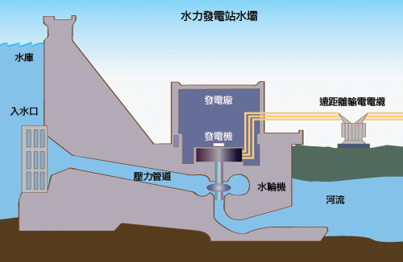

### 儲存位能
有些水庫(像是明潭發電廠),則是會利用電量離峰的時段,將下游的水抽蓄到上游的水池去,把電能透過轉成水的位能方式,達成儲能的效果.在台灣,就有明潭水力發電廠,會將下池的庫水抽回到上池.        


當政府在發展綠能發電時,首先遇到的問題就會是,大部分的綠能發電(風力,太陽能)都沒有辦法提供個穩定的基載電力.當天空突然出現一朵雲的時候,太陽能發電就會往下掉, 或是某天風力變弱的時候,風力發電也會跟著往下掉.這時候就需要儲能裝置放電去平順電壓.身為一個大型儲能系統的水庫,若有更多的水儲存在上游,那將可以產生更多的水力發電的機會.

## 水庫面臨的挑戰
目前台灣的水庫均有泥沙淤積的問題,從[新聞的報導](http://news.ltn.com.tw/news/life/breakingnews/2398506)裡提到,石門水庫原本庫容有3億噸，但受到長期流入庫區的泥沙等影響，目前庫容僅剩下約2億噸，面對每年桃園及板新地區共8億噸的用水，石門水庫1年周轉率要4次以上，因此，集水區在每季降雨量不足之下，往往會帶來缺水壓力。面對這樣的問題,除了要維護上游的水土保持之外,若每戶家庭都可以節約用水,那就會有更多的水是被儲存在上游的水庫中.這樣可以減少每年會遇到缺水的問題.

## 面臨經常性缺水的挑戰,我們可以在家做些什麼?
根據[新聞](http://news.ltn.com.tw/news/focus/paper/1150151)的報導,台灣平均的漏水率在105年是16%.漏水率指的是從水庫端的水,在運送水到用戶終點端中,運送過程中流失掉水的比例是多少.據個例子來說,若有上游水庫有一公升的水,運送到用戶端,將只會剩0.84公升(1*(1-0.16)).
換句話說,若你在家裡儲存一公升的水,在水庫端,就會多了1.19公升的水(1/(1-0.16)).當你在家裡越常使用回收水,就會在上游的水庫端儲存更多的水供民生用水或是發電.

## 儲水既然好處很多,為什麼大家不想做?
既然使用回收水可以讓上游的水庫有更多的水供民生用水,那為什麼一般人不想使用回收水?其中有一個原因是,儲存回收水太麻煩了.以台灣地區家庭用水比例來看,洗衣用水25%，洗澡用水21%，廁所用水21%，廚房用水25%，其他（洗手、洗臉等)8%. 若要大量地重複使用回收水,在考量用水地點的區域性後,一般人通常會把洗澡用水儲存起來沖馬桶.但是這個動作需要一個大人把水桶提起來,精準地倒在馬桶裡,並不是一件容易的事情.若是家中有小朋友,其實小朋友根本沒有能力做使用回收水這事.提水桶沖馬桶這事,對小朋友來說實在太難了.

## 微型水庫運作原理
微型水庫的設計初衷,就是讓家中小朋友在如廁後,不需要大人的協助,還是可以使用到回收水.讓家裡的每個人都可以輕鬆地使用到回收水.   
微型水庫運作的原理如下圖所示.當冬天洗澡時,由於一開始的水是冷的,並不適合淋浴,此時你可以幫這冰冷的水收集至位置較高的微型水庫(基本上就是一個水桶).這個微型水庫底部連接一根水管到馬桶儲水箱的一個控制器.此控制器裝有一個電磁閥開關,平時是關閉的,所以水不會往位置較低的馬桶儲水箱流動.此外,此控制器備有一個水位感測器,當偵測到如廁後水箱的水位降低時,就會自動開啟電磁閥開關,將回收水導入到馬桶儲水箱.當水位接近滿水的位置時,就會關閉電磁閥開關.
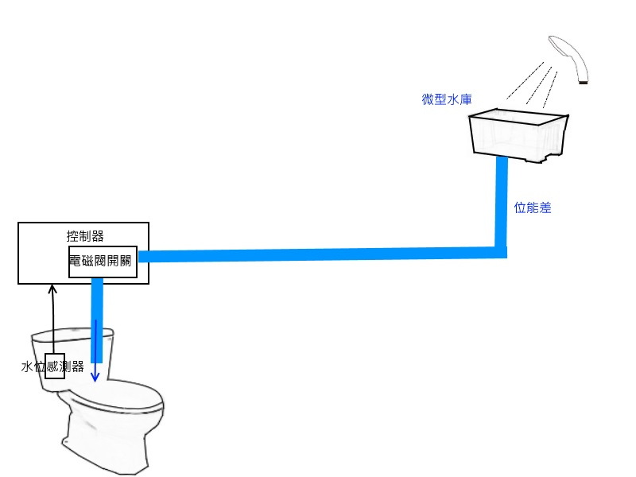
當馬桶儲水箱因沖水導致水位降低時,除了原先水箱內部的進水器會注水之外,同時間微型水庫也會因為電磁閥開啟後,同步一起注水.當水位慢慢增加到滿水位時,原先水箱內的進水器會停止注水.在這同時,微型水庫也會關閉電磁閥開關,停止注水.

相信看完微型水庫的運作原理後,應該會感覺到這是一個很簡單的控制系統.雖然簡單,但卻很實際地達到省水的功效.底下先來看看依據這樣的設計做出來的樣貌.

## 微型水庫實景
### 微型水庫操作影片
請點選此[連結查看微型水庫操作影片](https://www.facebook.com/hsiang.tai/videos/10156040506608347/)

### 微型水庫
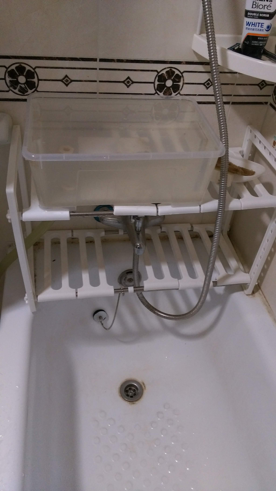
### 控制器
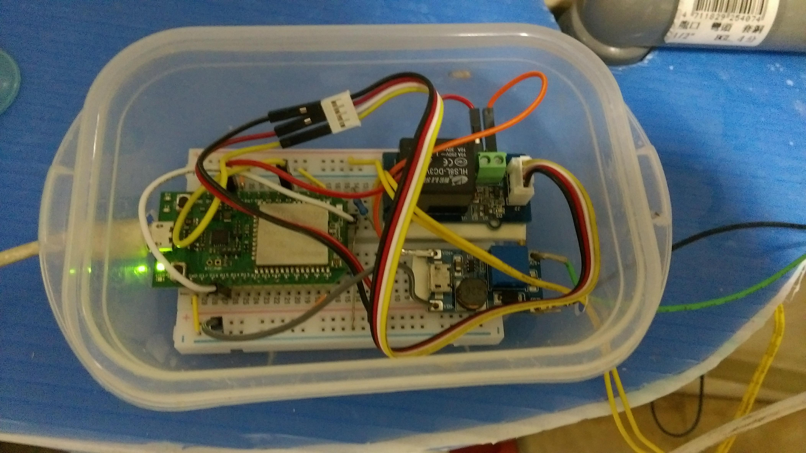
### 電磁閥開關&水位感測器
- 位於馬桶水箱內部
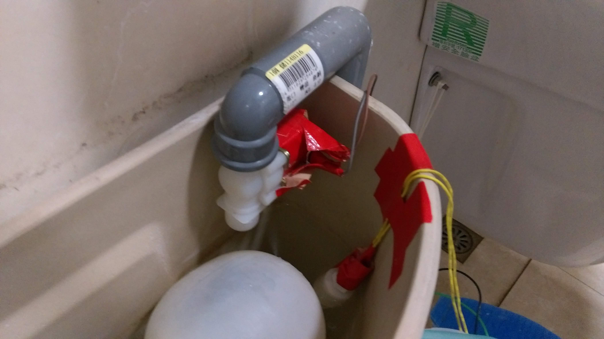

### 馬桶全景
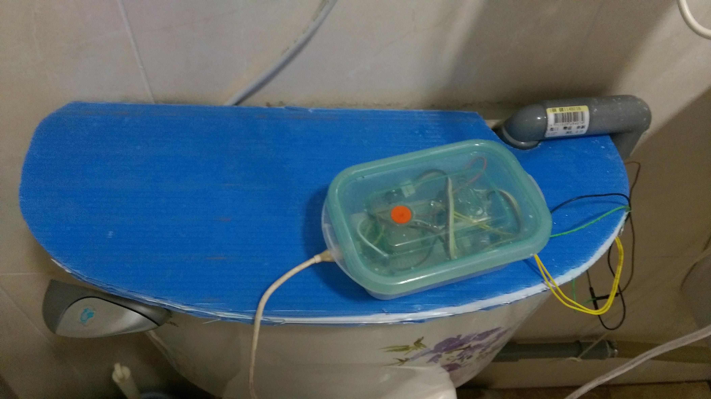
底下就介紹怎樣自行組裝這套系統
## 準備的器材
目前先把準備的器材分成3類,一類是比較偏向控制器的器材,另一類則是偏向水路管線的器材. 最後一類則是安裝外殼的器材
### 控制器器材
- MTK linkit 7697
    - 會選擇這顆晶片,主要是考量他有內建ADC,可以不用額外外掛太多的硬體,就能讀取到從水位感測器來的類比訊號.對於不太懂硬體的人來說,可以省去不少麻煩.
    - 這顆晶片可以使用Arduino撰寫,寫程式還蠻容易的
    - 這顆晶片本身支援BT和Wifi,若考慮日後要將資料自動上傳,這晶片可以在不用外掛額外晶片的情況下,將資料傳到Server
    - 這顆晶片的電源輸入是micro USB 接頭,可以直接將手機充電使用充電插頭接過來使用
    - 這顆晶片還算便宜
        - [購買資訊](https://www.taiwaniot.com.tw/shop/mcuboard/linkit-one/linkit-7697-開發板-聯發科-2017-最新-mt7697-家庭物聯網平台/)      

- 電源供應器
    - MTK linkit 7697接受micro USB接頭,所以我就拿一個手機附贈的充電器充當電源供應器.
- 4分管常閉式進水電磁閥 DC12V
    - 此電磁閥將會控制水路的開關
    - [參考購買資訊](http://www.buyic.com.tw/product_info.php?products_id=6490)
- 繼電器
  - 繼電器可以使用低電壓(3.3V)的訊號去控制需要高電壓(5V)的開關
  - [購買參考資訊](https://www.taiwaniot.com.tw/product/grove-relay-%E7%B9%BC%E9%9B%BB%E5%99%A8%E6%A8%A1%E7%B5%84-%E5%B3%B0%E5%80%BC%E9%9B%BB%E5%A3%93%E8%83%BD%E5%8A%9B250v-10%E5%AE%89%E5%9F%B9/)        

- 升壓模組
    - 將5V的電壓升壓成電磁閥所需要的12V電壓
        - [購買參考資訊](https://www.taiwaniot.com.tw/product/dc-dc%E9%9B%BB%E5%A3%93%E5%8D%87%E5%A3%93%E6%A8%A1%E7%B5%84-2a-%E5%8F%AF%E8%AA%BF%E5%BC%8F%E5%8D%87%E5%A3%93%E6%9D%BF-%E5%85%B7-microusb-%E8%BC%B8%E5%85%A5%E6%8E%A5%E5%8F%A3/)
- 水位感測器
    - 目前使用浮球液位開關
        - [購買參考資訊](http://goods.ruten.com.tw/item/show?21701022202739)
- 電阻
    - 7697 的 ADC 輸入電壓範圍是 0 到2.5V,我們需要兩顆電阻將原本3.3V電壓分壓到2.5V以下
    - 10K, 100K 1/4W即可
    - 電子材料行就可以買到
- 麵包板
    - 懶得焊接,所以所有的線都是直接接在麵包板上,方便做實驗.
    - 電子材料行就可以買到
-  接線
    -  需要一些接線將每個硬體模組串接在一起
    -  電子材料行就可以買到

### 管線&微型水庫容器

- PVC硬管
    - 1個L型PVC水管單邊套銅接彎頭,2個L型PVC水管,一根45cm PVC水管, 2根5cm PVC水管
    - 用於連接電磁閥開關
    - 可以去五金行買
- 6分軟管
    -  用於連接PVC硬管和微型水庫
- 微型水庫
    - 此為一個由一個儲存箱改裝
        - 此儲存箱在IKEA 購買改裝
- PVC 膠合劑
    - 用於連接PVC水管
- 止水帶
    - 用於在軟管和硬管的接合處
    - 防止漏水
- 白鐵管束 x2
    - 用於在軟管和硬管的接合處
    - 防止漏水
- 塑膠閥接頭4分
    - 在微型水庫底部打洞後,需要安裝塑膠筏接頭,這才可以將微型水庫接到軟管上

### 裝置外殼
- 微型水庫架子
    - 網路上有在賣不鏽鋼可調式水槽下收納架,由於架子上有洞,正好可以讓軟管通過,加上不鏽鋼,放在浴缸上不容易壞.
    - [參考購買資訊](https://24h.pchome.com.tw/prod/DEBA2J-A9008L5ME?q=/S/DEBA2J)
- 馬桶水箱蓋
    - 將家裡不用的珍珠板回收再利用
        - 將3層舊的珍珠板堆疊起來,自行手工切出符合原先馬桶水箱蓋的照型,並且挖了一個洞,讓水管線可以接進來
- 控制器盒子
    - 將家裡多餘的保鮮盒拿出來改裝,只要大小略大於麵包板即可,之後需要加工打洞,讓洞口可以外接電源和線路.

## 安裝
### 控制器電路圖
用這張圖解釋控制器的電路設計.
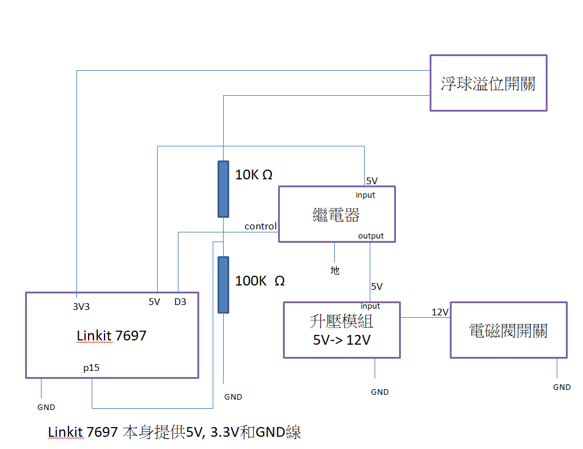     
Linkit 7697有提供5V,3.3V和GND的線,所以其他模組的電源和接地線軍可以從Linkit 7697的針腳拉出來. 此外,我們利用Linkit 7697的p15 針腳接收從浮球溢位開關來的類比訊號.接著Linkit 7697會透過D3針腳去控制繼電器的接通與否.當繼電器的input和output被接通後,升壓模組會把從繼電器來的5V訊號升壓成12V,接著再讓電磁閥開關做動.

### 管路接線
底下放幾張圖解釋一下管路自怎麼連接的
- 微型水庫和軟管的連接處
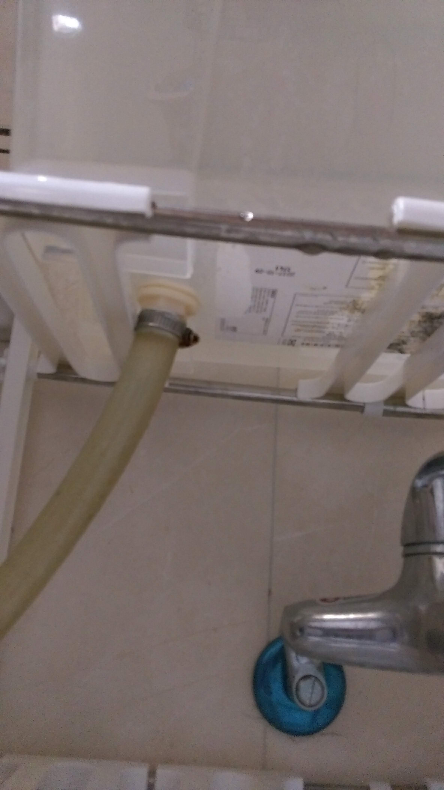
- 軟管和硬管的連接處
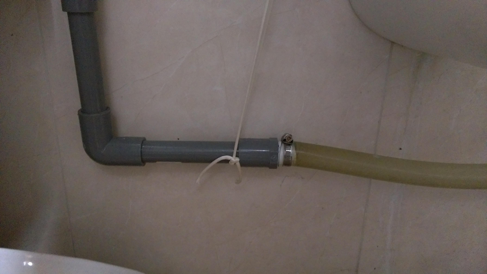
- 連接硬管
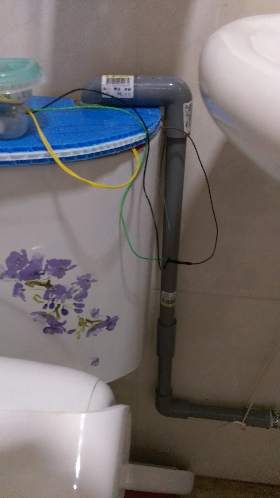

### 程式
此系統是寫在MTK linkit 7697的晶片上,
可以參考底下兩個連結,了解這個晶片的整個開發環境如何架設.
或者你也可以上官網查詢     
[LinkIt 7697開發板上市啦！ 燒燙燙開箱規格報你知](http://blog.cavedu.com/2017/04/28/linkit-7697%E9%96%8B%E7%99%BC%E6%9D%BF%E4%B8%8A%E5%B8%82%E5%95%A6%EF%BC%81-%E7%87%92%E7%87%99%E7%87%99%E9%96%8B%E7%AE%B1%E8%A6%8F%E6%A0%BC%E5%A0%B1%E4%BD%A0%E7%9F%A5/#prettyPhoto)     

[LinkIt 7697 評測與藍牙小車](http://www.ezmk.org/single-post/2017/06/04/MTK%E6%96%87-LinkIt-7697-%E8%A9%95%E6%B8%AC%E8%88%87%E8%97%8D%E7%89%99%E5%B0%8F%E8%BB%8A)       

因為系統有點簡單,所以程式也很短,想下載程式的人可以到底下這個Github repository下載.     
[點我](https://github.com/HuangHsiangTai/micro_reservoir/blob/master/micro_reservoir.ino)

### 預估省水量
由於微型水庫的容量不大,平時我也會將洗澡水儲存在水桶上,當微型水庫的水位太低時,我會用自己的生物能將水桶的水抬到微型水庫內,轉換成水的位能.        
我自己算過,我的家庭4口一天可以使用大約36公升的回收水,一個月則可以節省使用到1080公升的水,大約是1度的水.       
在經常缺水的季節裡,若每個家庭都可以利用這套系統輕鬆地省水的話,這樣會比較容易度過缺水的日子.

### 安裝計時器開關省電
本系統單純使用位能差將水注入馬桶的水箱,並沒有使用馬達去抽取回收水,所以損耗的電其實很少.
但若考量要再省電的話,可以將USB充電器接到一個計時器開關上面.平時我會設定週間上班時間和晚上睡覺時間計時器開關是關的.在這段時間,整個系統的電源將會被切斷.
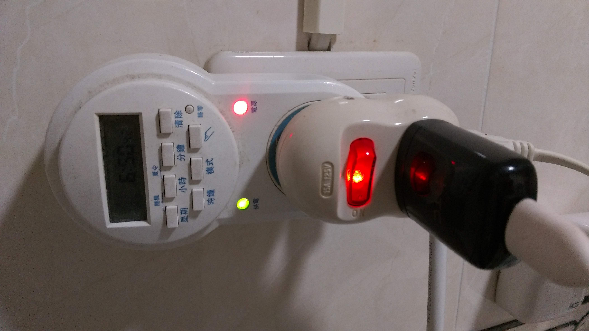

### 參考資源

- [回收馬桶水](http://m.home.appledaily.com.tw/article/index/20150418/36498961/design/%E5%9B%9E%E6%94%B6%E6%B0%B4%E6%B2%96%E9%A6%AC%E6%A1%B6%E7%9C%81%E6%9C%80%E5%A4%A7)
- [打造城市水庫](http://ourisland.pts.org.tw/content/%E6%89%93%E9%80%A0%E5%9F%8E%E5%B8%82%E6%B0%B4%E5%BA%AB#sthash.aoG7h6DD.C21HjKBX.dpbs)
- [線上電路模擬](http://www.partsim.com/)
- [電阻瓦數](http://n.sfs.tw/content/index/10197)
- [arduino水位偵測自動補水](https://www.youtube.com/watch?v=M-Mokj2YD98)

